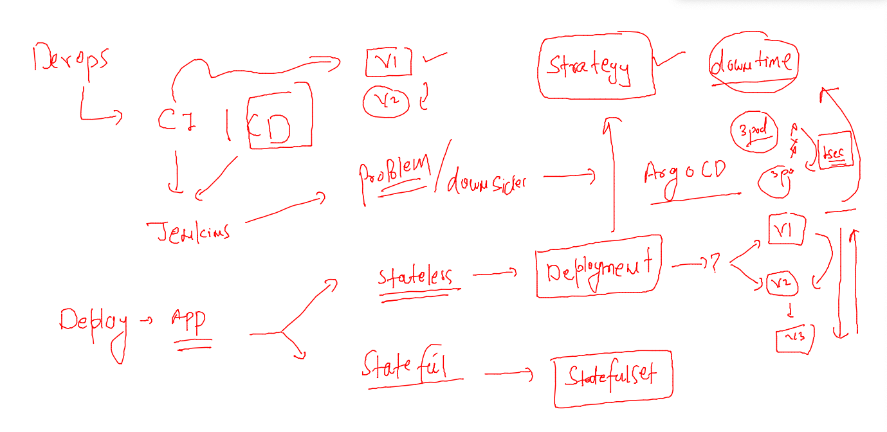
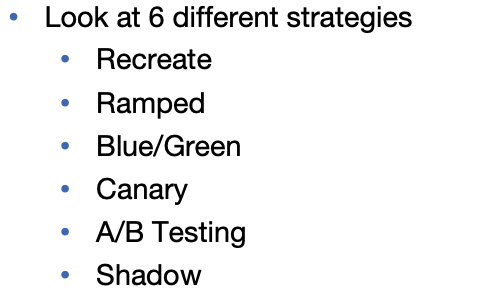
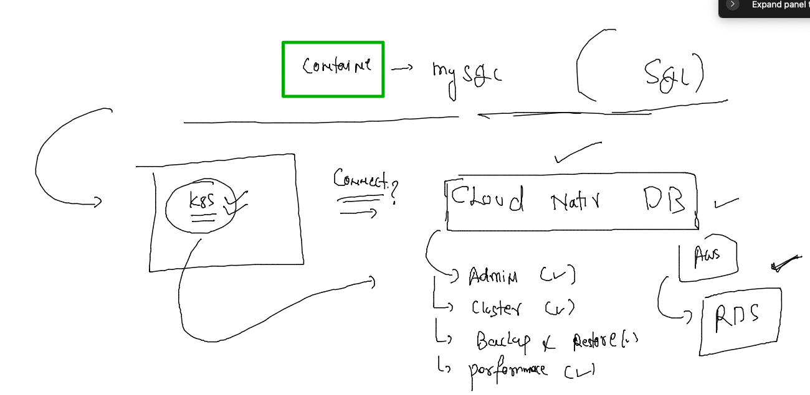
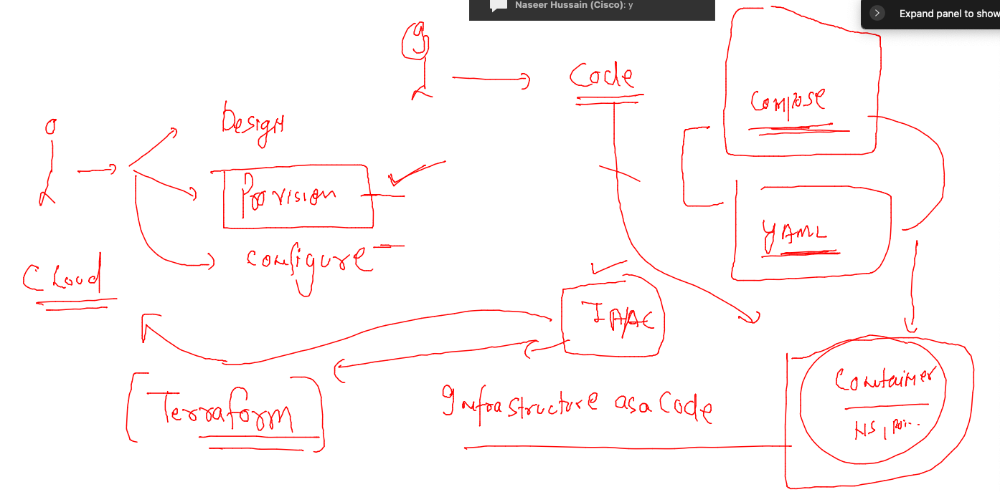
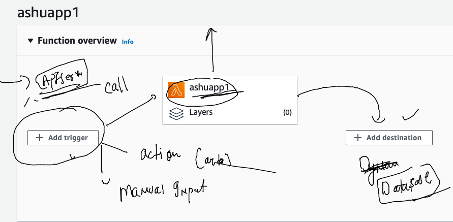

## training plan 


## Stateless vs statefulsets 



### strategy 



### getting password from argocd 

```
[root@client ~]# kubectl  get secret  -n argocd 
NAME                                        TYPE     DATA   AGE
argocd-initial-admin-secret                 Opaque   1      26h
argocd-notifications-secret                 Opaque   0      26h
argocd-secret                               Opaque   5      26h
cluster-kubernetes.default.svc-3396314289   Opaque   3      17h
repo-1629727592                             Opaque   3      17h
[root@client ~]# kubectl  get secret argocd-initial-admin-secret -o yaml  -n argocd 
apiVersion: v1
data:
  password: dTNhMTRpMXd1anJraVlJQw==
kind: Secret
metadata:
  creationTimestamp: "2022-06-29T02:20:04Z"
  name: argocd-initial-admin-secret
  namespace: argocd
  resourceVersion: "34657"
  uid: a4e2dd13-0556-4992-ab8f-47faf535c8ea
type: Opaque
[root@client ~]# 
[root@client ~]# 
[root@client ~]# echo "dTNhMTRpMXd1anJraVlJQw=="   |  base64 -d
u3a14i1wujrkiYIC[root@client ~]# 


```


## ARgoCD for wordpress application 

### db 
```
kubectl  create  deployment  ashudb --image=mysql:5.7  --port 3306 --namespace=ashu-project    --dry-run=client -o yaml >db_deploy.yaml
```

### configMAP 

```
kubectl  create  configmap  ashudb-config  --from-literal  MYSQL_DATABASE=ashudb  --namespace=ashu-project  --dry-run=client -o yaml  >db_config.yaml
```

###

```
[root@client webapp_db]# cat db_config.yaml 
apiVersion: v1
data:
  MYSQL_DATABASE: ashudb
  MYSQL_USER: ashuuser
kind: ConfigMap
metadata:
  creationTimestamp: null
  name: ashudb-config
  namespace: ashu-project
```

### password stored in secret 

```
kubectl  create  secret  generic  ashudb-sec  --from-literal db_pass="Cisco123456#" --from-literal      root_pass="Root@123456#"  --namespace=ashu-project  --dry-run=client -o yaml  >db_secret.yaml
```

### final YAML of deployment 

```
[root@client webapp_db]# cat db_secret.yaml 
apiVersion: v1
data:
  db_pass: Q2lzY28xMjM0NTYj
  root_pass: Um9vdEAxMjM0NTYj
kind: Secret
metadata:
  creationTimestamp: null
  name: ashudb-sec
  namespace: ashu-project
[root@client webapp_db]# vim db_deploy.yaml 
[root@client webapp_db]# cat db_deploy.yaml 
apiVersion: apps/v1
kind: Deployment
metadata:
  creationTimestamp: null
  labels:
    app: ashudb
  name: ashudb
  namespace: ashu-project
spec:
  replicas: 1
  selector:
    matchLabels:
      app: ashudb
  strategy: {}
  template:  # pod template 
    metadata:
      creationTimestamp: null
      labels:
        app: ashudb
    spec:
      volumes: # to create volume
      - name: ashudbvol
        hostPath: # pod will take space from Minion node 
         path: /data/ashudb
         type: DirectoryOrCreate 
      containers:
      - image: mysql:5.7
        name: mysql
        ports:
        - containerPort: 3306
        envFrom: # to call env variable from configMAP 
        - configMapRef:
           name: ashudb-config # name of configMAP 
        env: # calling other env with secret 
        - name: MYSQL_PASSWORD
          valueFrom:
            secretKeyRef:
              name: ashudb-sec
              key: db_pass
        - name: MYSQL_ROOT_PASSWORD
          valueFrom:
            secretKeyRef:
              name: ashudb-sec
              key: root_pass
        resources: {}
        volumeMounts: # to mount the volume created above
        - name: ashudbvol
          mountPath: /var/lib/mysql/
status: {}

```
### service clusterIP type for DB 

```
kubectl  create service clusterip  ashudblb  --tcp 3306:3306 --dry-run=client -o yaml >db_svc.yaml
```

### web deployment details 

```
 kubectl  create  deployment ashuwebapp --image=wordpress  --port 80 --namespace=ashu-project --dry-run=client -o yaml >web_deploy.yaml
```

### webconfig 

```
cat web_config.yaml 
apiVersion: v1
data:
  WORDPRESS_DB_USER: ashuuser
  WORDPRESS_DB_HOST: ashudblb  # name of db service 
  WORDPRESS_DB_NAME: ashudb 
kind: ConfigMap
metadata:
  creationTimestamp: null
  name: ashuweb-config
  namespace: ashu-project

```

### webdeployment 

```
[root@client webapp_db]# cat  web_deploy.yaml 
apiVersion: apps/v1
kind: Deployment
metadata:
  creationTimestamp: null
  labels:
    app: ashuwebapp
  name: ashuwebapp
  namespace: ashu-project
spec:
  replicas: 1
  selector:
    matchLabels:
      app: ashuwebapp
  strategy: {}
  template: # pod info 
    metadata:
      creationTimestamp: null
      labels:
        app: ashuwebapp
    spec:
      containers:
      - image: wordpress
        name: wordpress
        ports:
        - containerPort: 80
        envFrom: # calling docker image env variables 
        - configMapRef:
           name: ashuweb-config 
        env: # to call password from secret 
        - name: WORDPRESS_DB_PASSWORD
          valueFrom: # taking data from secret 
           secretKeyRef:
            name: ashudb-sec
            key: db_pass 

        resources: {}
status: {}

```

### web service 

```
 kubectl  create  service nodeport  ashuweblb1 --tcp 1234:80 --namespace ashu-project --dry-run=client -o yaml  >web_svc.yaml
 [root@client webapp_db]# cat web_svc.yaml 
apiVersion: v1
kind: Service
metadata:
  creationTimestamp: null
  labels:
    app: ashuweblb1
  name: ashuweblb1
  namespace: ashu-project
spec:
  ports:
  - name: 1234-80
    port: 1234
    protocol: TCP
    targetPort: 80
  selector:
    app: ashuwebapp # label of pods 
  type: NodePort
status:
  loadBalancer: {}
  

```

### replace container based DB -- to cloud based DB 



### IAC 



### install terraform anywhere 

### terraform view 



### ec2 creating tf script 

```
[root@client aws_automation]# cat ec2_vm_create.tf 
provider "aws"  {

	# access_key = ""
	# secret_key = ""
	region = "ap-south-1"

}

resource "aws_instance"  "ashuvm1" {

	ami = "ami-08df646e18b182346" # ami id from aws ec2 
	instance_type = "t2.micro"
	tags =  {

		"Name" = "ashuos1"
	}		
	key_name = "ashukey" 
	
}  

```


