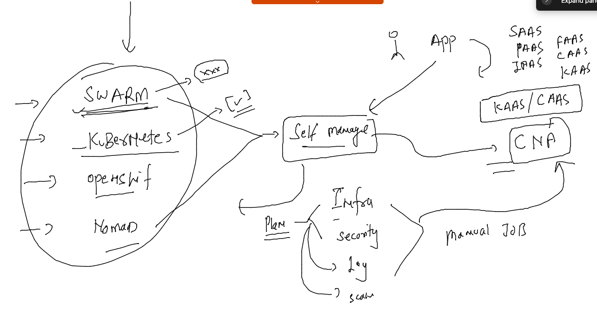
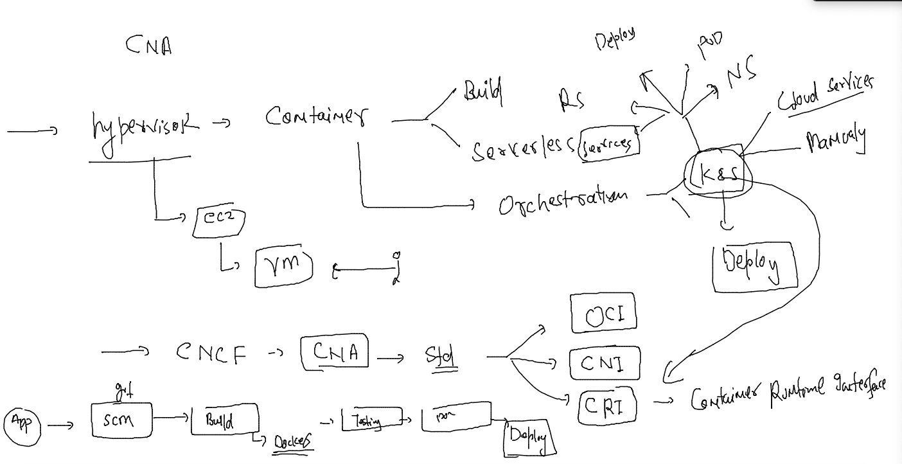
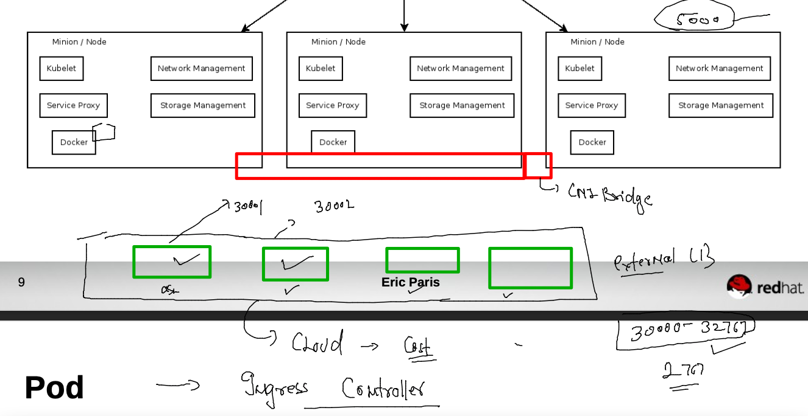
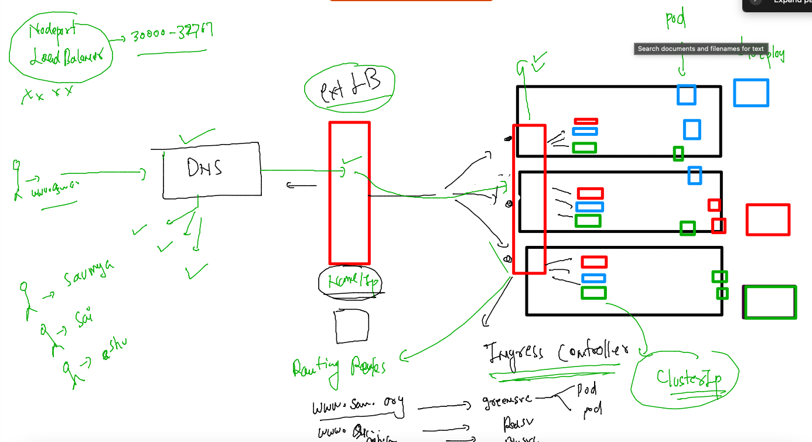

## training plan 



### Revision 



### intro to Ingress controller in k8s 



### cleaning up namespace 

```
 kubectl  delete all --all
pod "ashuwebapp-57c64f7f8-bsqxh" deleted
pod "ashuwebapp-57c64f7f8-gg8nb" deleted
service "ashulb1" deleted
service "ashulb2" deleted
deployment.apps "ashuwebapp" deleted
[root@client ~]# kubectl  get deploy 
No resources found in ashu-project namespace.
```

### understanding ingress controller 



## Testing Ingress -- 

### creating sample deployment 

```
 kubectl  create deployment  ashuapp --image=dockerashu/cat:v1 --port 80  --dry-run=client  -o yaml  >ashucat.yaml
```


