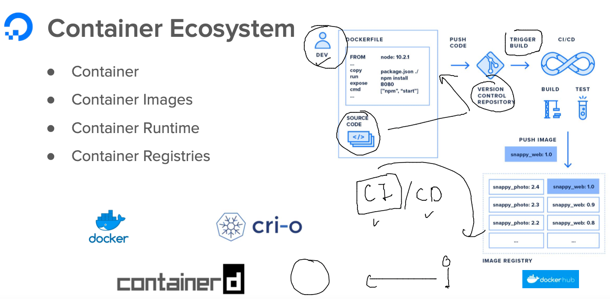
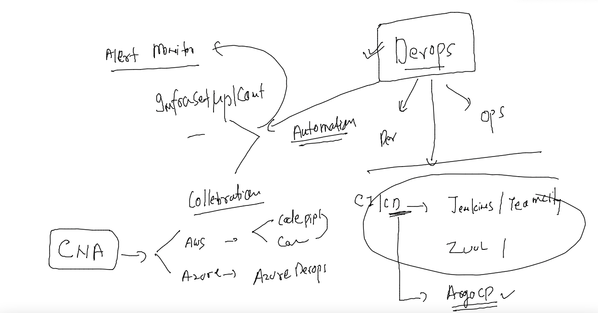
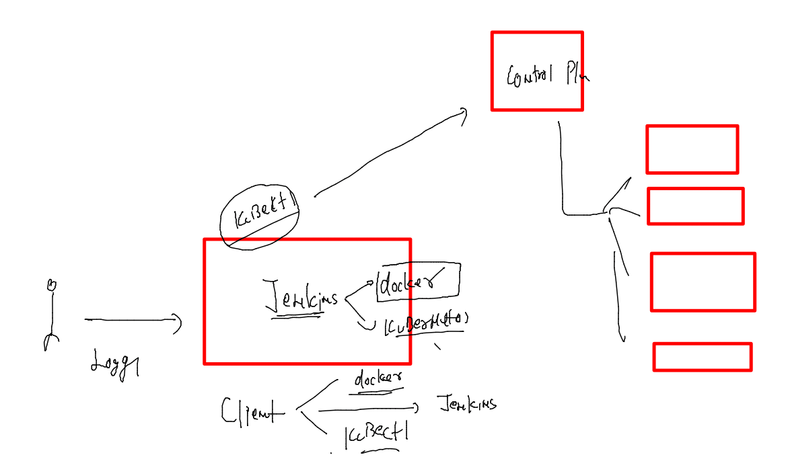

## training plan 


### Revision 


### intro to Ingress controller in k8s 


### cleaning up namespace 

```
 kubectl  delete all --all
pod "ashuwebapp-57c64f7f8-bsqxh" deleted
pod "ashuwebapp-57c64f7f8-gg8nb" deleted
service "ashulb1" deleted
service "ashulb2" deleted
deployment.apps "ashuwebapp" deleted
[root@client ~]# kubectl  get deploy 
No resources found in ashu-project namespace.
```

### understanding ingress controller 


## Testing Ingress -- 

### creating sample deployment 

```
 kubectl  create deployment  ashuapp --image=dockerashu/cat:v1 --port 80  --dry-run=client  -o yaml  >ashucat.yaml
```

### some changes 

```
[root@client ashuapp]# cat  ashucat.yaml 
apiVersion: apps/v1
kind: Deployment
metadata:
  creationTimestamp: null
  labels:
    app: ashuapp
  name: ashuapp
  namespace: ashu-project # namespace info 
spec:
  replicas: 2 # number of pods 
  selector:
    matchLabels:
      app: ashuapp
  strategy: {}
  template: # for pod creation 
    metadata:
      creationTimestamp: null
      labels:
        app: ashuapp
    spec:
      containers:
      - image: dockerashu/cat:v1
        name: cat
        ports:
        - containerPort: 80
        resources: # resource restrication of each pod 
          requests:
            cpu: 100m # CNA -- 1vcpu == 1000 milicore 
            memory: 200M
          limits:
            cpu: 200m
            memory: 400M 
status: {}

```

### deploy yAML

```
kubectl apply -f ashucat.yaml 
deployment.apps/ashuapp created
[root@client ashuapp]# kubectl  get deploy
NAME      READY   UP-TO-DATE   AVAILABLE   AGE
ashuapp   2/2     2            2           18s
[root@client ashuapp]# kubectl  get po -o wide
NAME                      READY   STATUS    RESTARTS   AGE   IP                NODE      NOMINATED NODE   READINESS GATES
ashuapp-cf5cf7c78-5r9t2   1/1     Running   0          25s   192.168.34.15     minion1   <none>           <none>
ashuapp-cf5cf7c78-pgcfc   1/1     Running   0          25s   192.168.179.209   minion2   <none>           <none>
[root@client ashuapp]# 

```

### creating cluster IP type service 

```
 kubectl  get  deploy 
NAME      READY   UP-TO-DATE   AVAILABLE   AGE
ashuapp   2/2     2            2           9m2s
[root@client ashuapp]# kubectl  expose deploy  ashuapp --type ClusterIP --port 1234 --target-port 80 --name ashulb1 
service/ashulb1 exposed
[root@client ashuapp]# kubectl  get  svc 
NAME      TYPE        CLUSTER-IP       EXTERNAL-IP   PORT(S)    AGE
ashulb1   ClusterIP   10.107.218.150   <none>        1234/TCP   7s
[root@client ashuapp]# kubectl  delete svc ashulb1 
service "ashulb1" deleted
[root@client ashuapp]# kubectl  expose deploy  ashuapp --type ClusterIP --port 1234 --target-port 80 --name ashulb1  --dry-run=client -o yaml  >ashucatsvc.yaml 
[root@client ashuapp]# kubectl  apply -f ashucatsvc.yaml 
service/ashulb1 created
[root@client ashuapp]# kubectl  get svc
NAME      TYPE        CLUSTER-IP       EXTERNAL-IP   PORT(S)    AGE
ashulb1   ClusterIP   10.101.242.166   <none>        1234/TCP   3s
[root@client ashuapp]# 


```

### routing rules 

```
cat ashu_route.yaml 
apiVersion: networking.k8s.io/v1
kind: Ingress
metadata:
  name: ashu-route-rule-1
  namespace: ashu-project 
  annotations:
    nginx.ingress.kubernetes.io/rewrite-target: /
spec:
  ingressClassName: nginx # name of class means product code name of ingress 
  rules:
  - host: www.ashu.io 
    http:
      paths:
      - path: /
        pathType: Prefix
        backend:
          service:
            name: ashulb1 # name of internal lb / svc 
            port:
              number: 80

```

### creating routing rules 

```
kubectl  apply -f ashu_route.yaml 
ingress.networking.k8s.io/ashu-route-rule-1 created
[root@client ashuapp]# 
[root@client ashuapp]# kubectl  get ingress
NAME                CLASS   HOSTS         ADDRESS   PORTS   AGE
ashu-route-rule-1   nginx   www.ashu.io             80      5s
[root@client ashuapp]# 

```

### CI | CD 



### tools 



### jenkins machine intro 



### jenkins container app testing code 

```
docker rm ashuc1 -f &>/dev/null
docker run -d --name ashuc1 ashuwebapp:ciscov1
ip=`docker inspect  ashuc1 --format='{{.NetworkSettings.IPAddress}}'`
curl -f http://$ip/health.html
```


