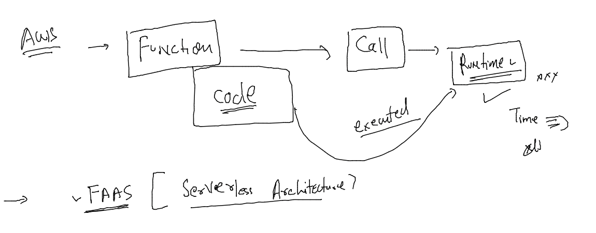

## training plan 


### Serverless


### FAAS 



### lambda function view 


### compsoe file 

```
version: "3.8" # it is automatically going to create a docker network bridge 
services: # your application stack 
  ashufrontend:
   image: wordpress # image from docker hub already have a webapp 
   container_name: ashuc1 
   restart: always 
   ports:
     - 1234:80 # expose application to external world 
   environment:
     WORDPRESS_DB_HOST: ashubackdb 
     WORDPRESS_DB_USER: ashuuser
     WORDPRESS_DB_PASSWORD: "Cisco123456#"
     WORDPRESS_DB_NAME: ashudb
   depends_on:  # it will wait for db container to be in ready state 
     - ashubackdb
  ashubackdb: 
   image: mysql:5.7
   container_name: ashucdb1 
   restart: always 
   environment:
    MYSQL_DATABASE: ashudb  
    MYSQL_USER: ashuuser
    MYSQL_PASSWORD: "Cisco123456#"
    MYSQL_RANDOM_ROOT_PASSWORD: "1"
   volumes: # mount volume 
    - ashudbvol:/var/lib/mysql/  
#networks
volumes: # creating docker volume 
 ashudbvol: # name of volume
```

### services check 

```
docker-compose  up -d 
[+] Running 2/2
 ⠿ ashubackdb Pulled                                                                                                       2.6s
 ⠿ ashufrontend Pulled                                                                                                     2.7s
[+] Running 4/4
 ⠿ Network ashuapp_default     Created                                                                                     0.2s
 ⠿ Volume "ashuapp_ashudbvol"  Created                                                                                     0.0s
 ⠿ Container ashucdb1          Started                                                                                     3.9s
 ⠿ Container ashuc1            Started                                                                                     3.0s
[root@ip-172-31-0-119 ashuapp]# docker  network ls
NETWORK ID     NAME                  DRIVER    SCOPE
d098f5e9c8b7   ashuapp_default       bridge    local
ce7cf889a5a4   bridge                bridge    local
791f31ad26d1   host                  host      local
f899626f209b   none                  null      local
53e0f9ec1127   ravi_default          bridge    local
0f17d8d8d21a   saidul_default        bridge    local
717880c19ac6   saththirapp_default   bridge    local
[root@ip-172-31-0-119 ashuapp]# docker-compose  ps
NAME                COMMAND                  SERVICE             STATUS              PORTS
ashuc1              "docker-entrypoint.s…"   ashufrontend        running             0.0.0.0:1234->80/tcp, :::1234->80/tcp
ashucdb1            "docker-entrypoint.s…"   ashubackdb          running             3306/tcp, 33060/tcp
[root@ip-172-31-0-119 ashuapp]# 


```

### sample check 

```

[root@ip-172-31-0-119 ashuapp]# docker exec -it  ashucdb1  bash 
root@0ba2c311c80d:/# cd /var/lib/mysql
root@0ba2c311c80d:/var/lib/mysql# ls
ashudb	  ca-key.pem  client-cert.pem  ib_buffer_pool  ib_logfile1  ibtmp1  performance_schema	public_key.pem	 server-key.pem
auto.cnf  ca.pem      client-key.pem   ib_logfile0     ibdata1	    mysql   private_key.pem	server-cert.pem  sys
root@0ba2c311c80d:/var/lib/mysql# ls  ashudb 
db.opt		    wp_links.frm     wp_postmeta.ibd		wp_term_taxonomy.frm  wp_terms.ibd
wp_commentmeta.frm  wp_links.ibd     wp_posts.frm		wp_term_taxonomy.ibd  wp_usermeta.frm
wp_commentmeta.ibd  wp_options.frm   wp_posts.ibd		wp_termmeta.frm       wp_usermeta.ibd
wp_comments.frm     wp_options.ibd   wp_term_relationships.frm	wp_termmeta.ibd       wp_users.frm
wp_comments.ibd     wp_postmeta.frm  wp_term_relationships.ibd	wp_terms.frm	      wp_users.ibd
root@0ba2c311c80d:/var/lib/mysql# exit
exit

```

### problem with containers -- 


### CNA -- new approach 


### k8s architecture 


### Swarm and k8s 


### OCI and RUNC 


### OCI and CRI 


## all the steps to deploy a application in k8s 

### app to container image 

```
 docker-compose  down 
Warning: No resource found to remove for project "ashuapp".
[root@ip-172-31-0-119 ashuapp]# git clone https://github.com/schoolofdevops/html-sample-app.git
Cloning into 'html-sample-app'...
remote: Enumerating objects: 74, done.
remote: Total 74 (delta 0), reused 0 (delta 0), pack-reused 74
Receiving objects: 100% (74/74), 1.38 MiB | 6.80 MiB/s, done.
Resolving deltas: 100% (5/5), done.
[root@ip-172-31-0-119 ashuapp]# ls
docker-compose.yaml  html-sample-app
[root@ip-172-31-0-119 ashuapp]# ls -a html-sample-app/
.  ..  .git  LICENSE.txt  README.txt  assets  elements.html  generic.html  html5up-phantom.zip  images  index.html
[root@ip-172-31-0-119 ashuapp]# 


```

### add dockerfile to build image 

```
cat Dockerfile 
FROM nginx
LABEL name=ashutoshh
LABEL email=ashutoshh@linux.com
COPY html-sample-app  /usr/share/nginx/html/
EXPOSE 80 

```

### .dockerignore file 

```
ls -a html-sample-app/
.  ..  .git  LICENSE.txt  README.txt  assets  elements.html  generic.html  html5up-phantom.zip  images  index.html
[root@ip-172-31-0-119 ashuapp]# cat .dockerignore 
html-sample-app/.git
html-sample-app/LICENSE.txt
html-sample-app/README.txt

```
### building image 

```
 docker  build -t  ashuweb:ciscoappv1 . 
Sending build context to Docker daemon  2.101MB
Step 1/5 : FROM nginx
latest: Pulling from library/nginx
b85a868b505f: Already exists 
f4407ba1f103: Pull complete 
4a7307612456: Pull complete 
935cecace2a0: Pull complete 
8f46223e4234: Pull complete 
fe0ef4c895f5: Pull complete 
Digest: sha256:10f14ffa93f8dedf1057897b745e5ac72ac5655c299dade0aa434c71557697ea
Status: Downloaded newer image for nginx:latest
 ---> 55f4b40fe486
Step 2/5 : LABEL name=ashutoshh
 ---> Running in 9c754353c91b

```

### time to push this image to Image registry 


### DOCKER HUB 


### time for deployment -- using controllers 


### generate YAML file 

```
kubectl  create  deployment  ashuwebapp --image=docker.io/dockerashu/ashuweb:ciscoappv1  --port 80        --dry-run=client -o yaml >ashudeploy.yaml 
[root@client ashuapp]# kubectl  create  deployment  ashuwebapp --image=docker.io/dockerashu/ashuweb:ciscoappv1  --port 80        --dry-run=client -o yaml 
apiVersion: apps/v1
kind: Deployment
metadata:
  creationTimestamp: null
  labels:
    app: ashuwebapp
  name: ashuwebapp
spec:
  replicas: 1
  selector:

```

### check deployment 

```
kubectl apply -f  ashudeploy.yaml 
deployment.apps/ashuwebapp created
[root@client ashuapp]# kubectl  get deploy 
NAME         READY   UP-TO-DATE   AVAILABLE   AGE
ashuwebapp   0/1     1            0           4s
[root@client ashuapp]# kubectl  get po
NAME                          READY   STATUS              RESTARTS   AGE
ashuwebapp-7b75dbb8c5-266xw   1/1     Running             0          10s
ciscoappv1-85ffd84fdc-z7x2w   0/1     ContainerCreating   0          0s
manuwebapp-79f9d9d544-ldfxr   0/1     ContainerCreating   0          1s
[root@client ashuapp]# kubectl  get deploy 
NAME           READY   UP-TO-DATE   AVAILABLE   AGE
ashuwebapp     1/1     1            1           15s
```

### CNI for container networking 


### calico cni 

```
[root@client ashuapp]# kubectl  get  po -n kube-system 
NAME                                       READY   STATUS    RESTARTS       AGE
calico-kube-controllers-6766647d54-7xmhb   1/1     Running   1 (154m ago)   5h58m
calico-node-2m444                          1/1     Running   1 (154m ago)   5h58m
calico-node-47wvd                          1/1     Running   1 (154m ago)   5h58m
calico-node-75m4k                          1/1     Running   1 (154m ago)   5h58m
```

### scaling pod using deploy -- manually 

```
kubectl   scale deployment  ashuwebapp  --replicas=2
deployment.apps/ashuwebapp scaled
[root@client ashuapp]# kubectl  get  deploy 
NAME             READY   UP-TO-DATE   AVAILABLE   AGE
ashuwebapp       2/2     2            2           19m
```

### type of service 


```
 kubectl  expose deployment  ashuwebapp  --type NodePort  --port 1234  --target-port 80 --name ashulb1
service/ashulb1 exposed
[root@client ashuapp]# kubectl  get  svc
NAME         TYPE        CLUSTER-IP       EXTERNAL-IP   PORT(S)          AGE
ashulb1      NodePort    10.111.155.185   <none>        1234:31128/TCP   4s
kubernetes   ClusterIP   10.96.0.1        <none>        443/TCP          6h17m
```


