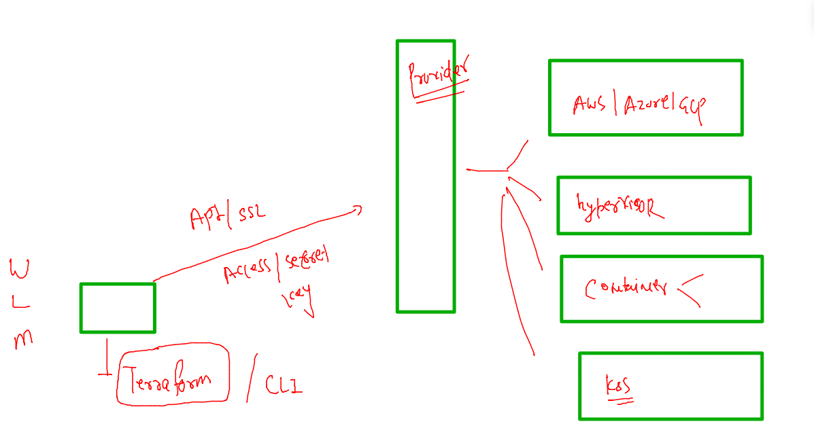

## training plan 


### Serverless


### FAAS 


### lambda function view 



### compsoe file 

```
version: "3.8" # it is automatically going to create a docker network bridge 
services: # your application stack 
  ashufrontend:
   image: wordpress # image from docker hub already have a webapp 
   container_name: ashuc1 
   restart: always 
   ports:
     - 1234:80 # expose application to external world 
   environment:
     WORDPRESS_DB_HOST: ashubackdb 
     WORDPRESS_DB_USER: ashuuser
     WORDPRESS_DB_PASSWORD: "Cisco123456#"
     WORDPRESS_DB_NAME: ashudb
   depends_on:  # it will wait for db container to be in ready state 
     - ashubackdb
  ashubackdb: 
   image: mysql:5.7
   container_name: ashucdb1 
   restart: always 
   environment:
    MYSQL_DATABASE: ashudb  
    MYSQL_USER: ashuuser
    MYSQL_PASSWORD: "Cisco123456#"
    MYSQL_RANDOM_ROOT_PASSWORD: "1"
   volumes: # mount volume 
    - ashudbvol:/var/lib/mysql/  
#networks
volumes: # creating docker volume 
 ashudbvol: # name of volume
```


