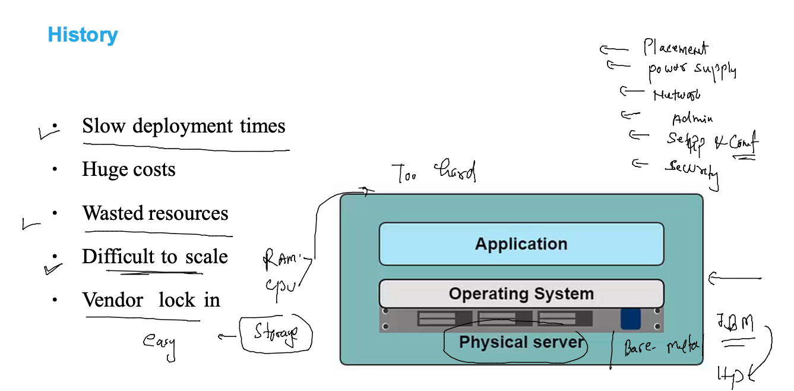

## training plan 

### problems in application deployment with bare-metal 

### wastage of resources due to app libs conflict 

### application conflict problem solved by Hypervisor 

### type of hyperVisors 

type 1 vs type 2 

### hypervisor and vm problems 

### alot of manual management in managing hypervisors 

### Cloud deployments and delivery models 

### public cloud 

### private cloud 

### Cloud Delivery models 

### models 

### model

