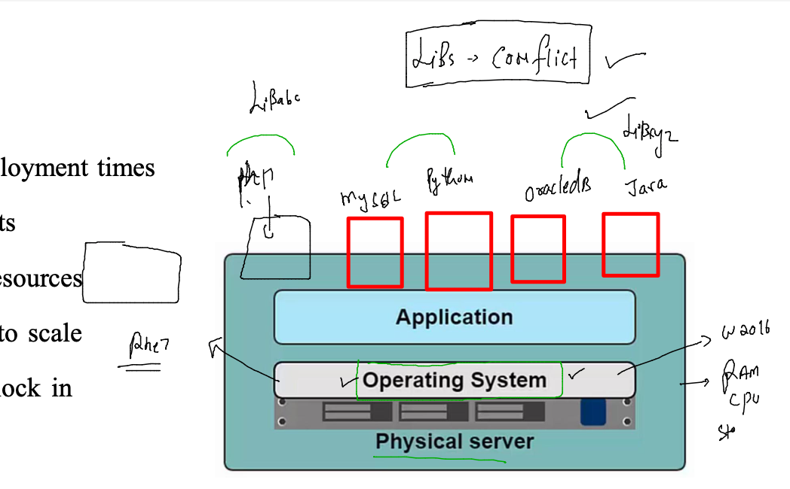
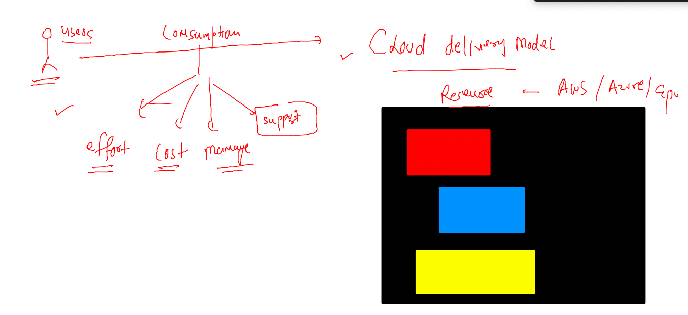

## training plan 


### problems in application deployment with bare-metal 


### wastage of resources due to app libs conflict 



### application conflict problem solved by Hypervisor 


### type of hyperVisors 

type 1 vs type 2 


### hypervisor and vm problems 


### alot of manual management in managing hypervisors 


### Cloud deployments and delivery models 


### public cloud 


### private cloud 


### Cloud Delivery models 



### models 


### model


### some important cloud charecteristics 


### users and permission in cloud for roles access 


### user access type 


### understanding Migration 


### services in cloud for general Infra planning 


### IAAS in AWS -- EC2 --


### connecting a linux vm from MAC / Linux Client machine 

```
cd Downloads 
fire@ashutoshhs-MacBook-Air Downloads % ssh -i ashukey.pem  ec2-user@13.233.204.125 
The authenticity of host '13.233.204.125 (13.233.204.125)' can't be established.
ECDSA key fingerprint is SHA256:+L4oureNK8mG8X2oHoGkG9DUxH0/2DIiAv8qHQHdPDo.
Are you sure you want to continue connecting (yes/no/[fingerprint])? yes
Warning: Permanently added '13.233.204.125' (ECDSA) to the list of known hosts.
@@@@@@@@@@@@@@@@@@@@@@@@@@@@@@@@@@@@@@@@@@@@@@@@@@@@@@@@@@@
@         WARNING: UNPROTECTED PRIVATE KEY FILE!          @
@@@@@@@@@@@@@@@@@@@@@@@@@@@@@@@@@@@@@@@@@@@@@@@@@@@@@@@@@@@
Permissions 0644 for 'ashukey.pem' are too open.
It is required that your private key files are NOT accessible by others.
This private key will be ignored.
Load key "ashukey.pem": bad permissions
ec2-user@13.233.204.125: Permission denied (publickey,gssapi-keyex,gssapi-with-mic).
fire@ashutoshhs-MacBook-Air Downloads % 
fire@ashutoshhs-MacBook-Air Downloads % chmod 400 ashukey.pem 
fire@ashutoshhs-MacBook-Air Downloads % ssh -i ashukey.pem  ec2-user@13.233.204.125 

       __|  __|_  )
       _|  (     /   Amazon Linux 2 AMI
      ___|\___|___|

https://aws.amazon.com/amazon-linux-2/
-bash: warning: setlocale: LC_CTYPE: cannot change locale (UTF-8): No such file or directory
[ec2-user@ip-172-31-20-206 ~]$ 


```


### Manual migration from Local /on-prem to AWS cloud -- EC2 

### step 1 analysis of application 


### Installing httpd apache webserver linux root user 

### step 1 

```
 yum  install httpd 
Failed to set locale, defaulting to C
Loaded plugins: extras_suggestions, langpacks, priorities, update-motd
amzn2-core                                                                                 | 3.7 kB  00:00:00     
Resolving Dependencies
--> Running transaction check
---> Package httpd.x86_64 0:2.4.53-1.amzn2 will be installed
--> Processing Dependency: httpd-tools = 2.4.53-1.amzn2 for package: httpd-2.4.53-1.amzn2.x86_64
--> Processing Dependency: httpd-filesystem = 2.4.53-1.amzn2 for package: httpd-2.4.53-1.amzn2.x86_64
--> Processing Dependency: system-logos-httpd for package: httpd-2.4.53-1.amzn2.x86_64
--> Processing Dependency: mod_http2 for package: httpd-2.4.53-1.amzn2.x86_64
--> Processing Dependency: httpd-filesys
```

### data transfer from on-prem to cloud 


### using git to get the webppage soucecode 

```
  7  yum  install git -y 
    8  history 
[root@ip-172-31-20-206 ~]# git clone https://github.com/redashu/multi-page-website.git
Cloning into 'multi-page-website'...
remote: Enumerating objects: 91, done.
remote: Counting objects: 100% (14/14), done.
remote: Compressing objects: 100% (12/12), done.
remote: Total 91 (delta 3), reused 0 (delta 0), pack-reused 77
Receiving objects: 100% (91/91), 1.17 MiB | 2.07 MiB/s, done.
Resolving deltas: 100% (45/45), done.
[root@ip-172-31-20-206 ~]# ls
multi-page-website

```

### copy data into the right location 

```
# cp -rfv multi-page-website/*  /var/www/html/
'multi-page-website/azure-pipelines.yml' -> '/var/www/html/azure-pipelines.yml'
'multi-page-website/buttons.html' -> '/var/www/html/buttons.html'
'multi-page-website/calculator.html' -> '/var/www/html/calculator.html'
'multi-page-website/Dockerfile' -> '/var/www/html/Dockerfile'
'multi-page-website/forms.html' -> '/var/www/html/forms.html'

```

### start app server 

```
systemctl start httpd
[root@ip-172-31-20-206 ~]# systemctl enable httpd
Created symlink from /etc/systemd/system/multi-user.target.wants/httpd.service to /usr/lib/systemd/system/httpd.service.
[root@ip-172-31-20-206 ~]# systemctl status  httpd
● httpd.service - The Apache HTTP Server
   Loaded: loaded (/usr/lib/systemd/system/httpd.service; enabled; vendor preset: disabled)
   Active: active (running) since Mon 2022-06-27 09:28:49 UTC; 10s ago
     Docs: man:httpd.service(8)
 Main PID: 3702 (httpd)

```

